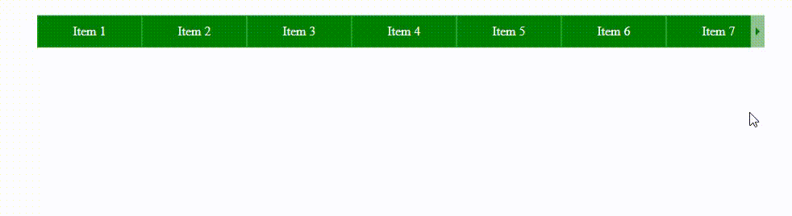

### Проект: Виджет горизонтальный скролл бар

## Используемые технологии

* HTML
* CSS
* JS
* БЭМ верстка
* Адаптивная верстка

## Описание

Виджет представляет собой горизонтальный блок с набором элементов, если элементы выходят за пределы блока то они становяться невидимые. Доступ к скрытым элементам организован как и при нажатие на боковые кнопки так и по скроллу колесика мыши.

* Скролл без полосы прокрутки
* Кнопки навигации, которые появляются и скрываются если скролл дошел до границ блока
* Адаптивный блок
